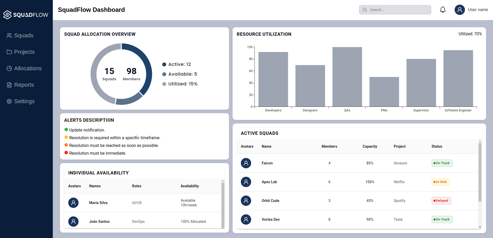

  <h1>SquadFlow Dashboard</h1>
  
An internal enterprise platform designed for team allocation, capacity monitoring, and resource management.

  

    
    
    
    
    
  

---

## Overview

SquadFlow is an internal operational dashboard tailored for Human Resources, Project Managers, and Operations teams. It provides visibility into squad availability, allocation metrics, and risk statuses across concurrent business projects.

The current implementation features the complete core dashboard interface, built with strict type safety, modular architecture, and component reusability[cite: 3].

---

## Preview

  

---

## Features

- **Squad Allocation Overview:** Visual distribution metrics representing active vs. available capacity[cite: 3].
- **Resource Utilization:** Department-level resource breakdown across development, design, and management roles[cite: 3].
- **Active Squads Monitor:** Real-time visibility into project allocations, capacity percentages, and status tracking (On Track, At Risk, Delayed)[cite: 2, 3].
- **Individual Availability:** Per-member bandwidth indicators and role allocation[cite: 1, 3].
- **Alert Prioritization:** Standardized notification hierarchy based on action urgency[cite: 3].

---

## Tech Stack

| Domain               | Technology                      |
| :------------------- | :------------------------------ |
| Framework & Core     | React, Vite                     |
| Programming Language | TypeScript                      |
| Styling & Theming    | SCSS Modules, Material UI (MUI) |
| Icons                | React Icons                     |
